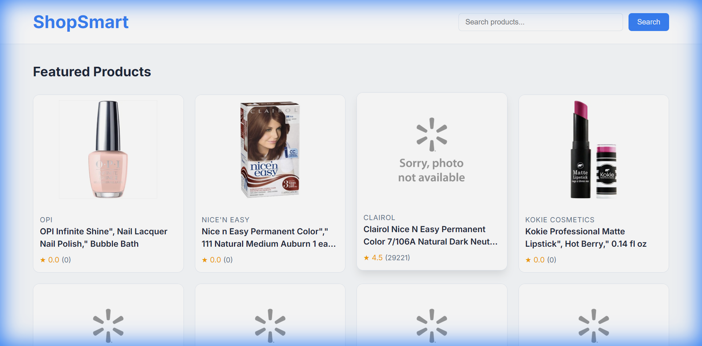
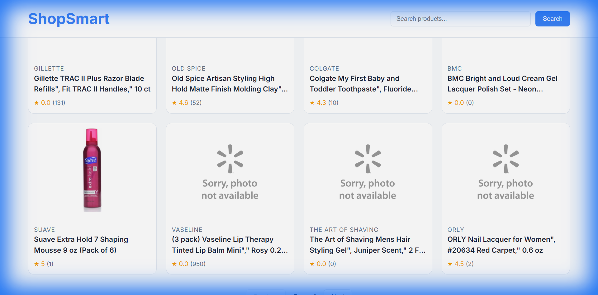
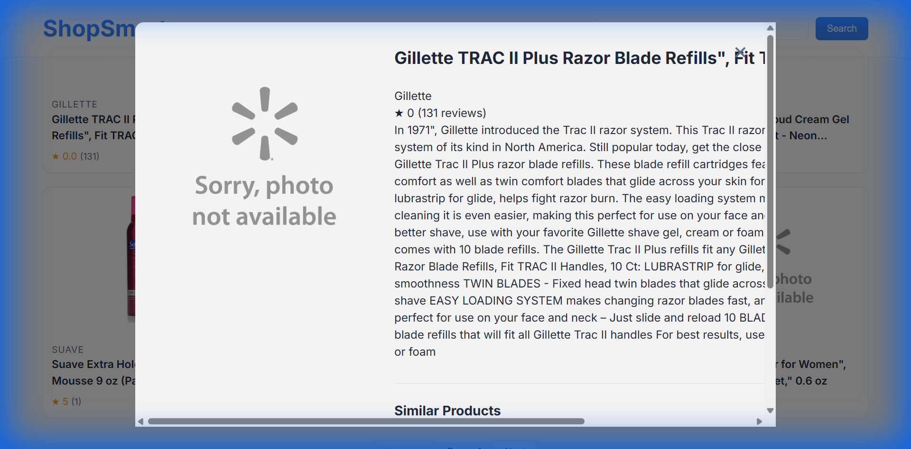

# E-Commerce Recommendation System 🚀🛍️

A complete end-to-end e-commerce recommendation engine featuring a data engineering pipeline, machine learning models, and a modern web application.



## 🔍 Project Overview
This project builds a full-stack recommendation system. It starts with raw data ingestion, processes it through an ETL pipeline, trains sophisticated recommendation models (Content-Based, Collaborative Filtering, and Hybrid), and serves them via a FastAPI backend to a responsive frontend application.

### Key Features
- **Full Stack Web App**: Modern UI for browsing products and viewing recommendations.
- **Advanced Recommendations**:
  - **Content-Based**: TF-IDF on product tags.
  - **Collaborative Filtering**: User-Item matrix with Cosine Similarity.
  - **Hybrid**: Combines both for best results.
- **REST API**: FastAPI backend with Swagger documentation.
- **Data Pipeline**: ETL process using Azure Data Factory and PySpark (simulated locally).

---

## 📸 Screenshots

### Personalized Recommendations
*Hybrid recommendations combining user history and product features.*


### Product Details & Similar Items
*Contextual recommendations based on the specific product being viewed.*


---

## 🚀 Quick Start

### 1. Clone the repo
```bash
git clone <repo-url>
cd DEPI-final-project
```

### 2. Environment Setup
```bash
# Create virtual env
python -m venv .venv
# Activate (Windows)
.venv\Scripts\activate
# Install dependencies
pip install -r requirements.txt
```

### 3. Run the Application
Start the backend server (API + Frontend):
```bash
python -m uvicorn api.main:app --reload --host 0.0.0.0 --port 8001
```

### 4. Access
- **Web App**: http://localhost:8001/
- **API Docs**: http://localhost:8001/docs

---

## 🏗️ Architecture

1.  **Data Layer**: `dataset/cleaned_data.csv` (Processed from raw sources)
2.  **Model Layer**: 
    -   `scripts/train_models.py`: Trains and persists models to `model_artifacts/`
    -   `api/services/recommender.py`: Loads models for inference
3.  **API Layer**: FastAPI application serving REST endpoints
4.  **Frontend Layer**: HTML/CSS/JS single-page application

---

## 👥 Team
Team 165:
- Mohamed Ahmed Abdelkader
- Badr Islam
- Malek Anas
- Alaa Mahmoud
- Mazen Maysara Shawqi
- Yousef Mohamed Elsayed

Supervisor: Eng. Mohamed Hamed

---

## 📄 License
MIT License
